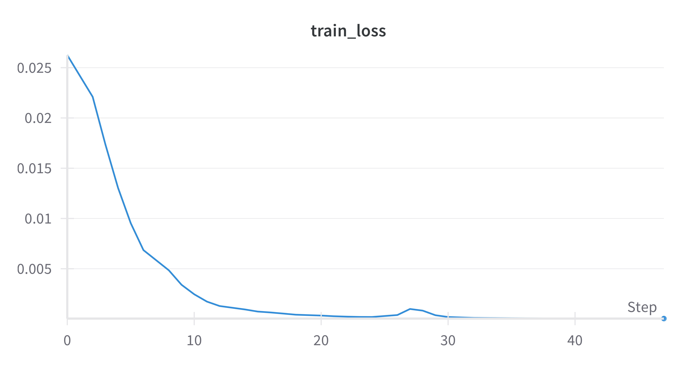
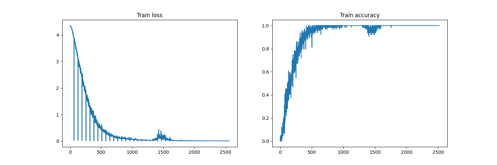
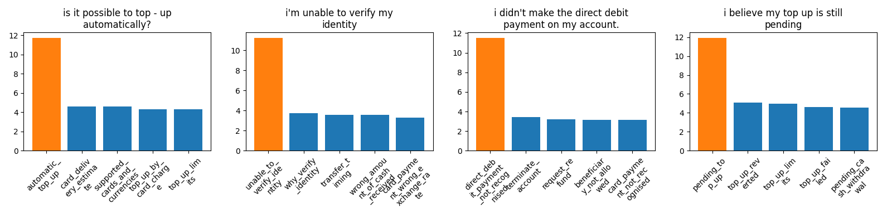
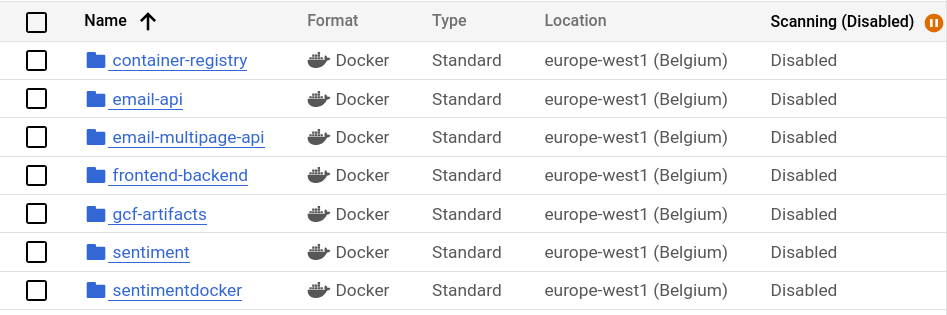
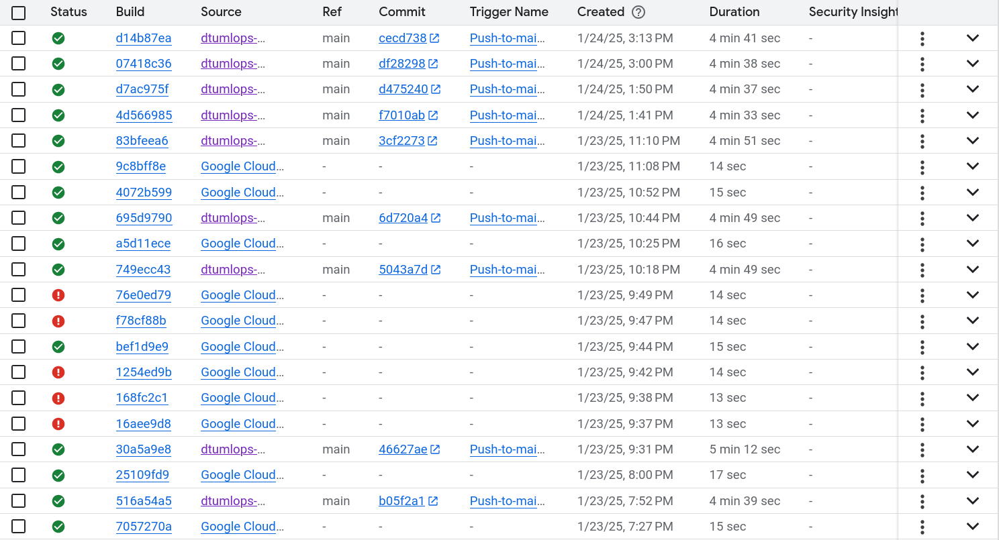
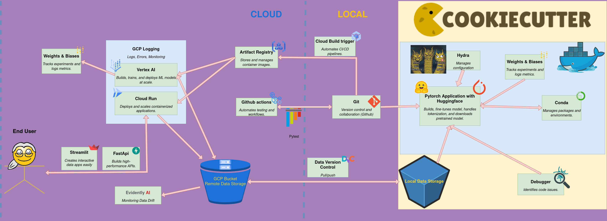

# Exam template for 02476 Machine Learning Operations

This is the report template for the exam. Please only remove the text formatted as with three dashes in front and behind
like:

```--- question 1 fill here ---```

Where you instead should add your answers. Any other changes may have unwanted consequences when your report is
auto-generated at the end of the course. For questions where you are asked to include images, start by adding the image
to the `figures` subfolder (please only use `.png`, `.jpg` or `.jpeg`) and then add the following code in your answer:

``

In addition to this markdown file, we also provide the `report.py` script that provides two utility functions:

Running:

```bash
python report.py html
```

Will generate a `.html` page of your report. After the deadline for answering this template, we will auto-scrape
everything in this `reports` folder and then use this utility to generate a `.html` page that will be your serve
as your final hand-in.

Running

```bash
python report.py check
```

Will check your answers in this template against the constraints listed for each question e.g. is your answer too
short, too long, or have you included an image when asked. For both functions to work you mustn't rename anything.
The script has two dependencies that can be installed with

```bash
pip install typer markdown
```

## Overall project checklist

The checklist is *exhaustive* which means that it includes everything that you could do on the project included in the
curriculum in this course. Therefore, we do not expect at all that you have checked all boxes at the end of the project.
The parenthesis at the end indicates what module the bullet point is related to. Please be honest in your answers, we
will check the repositories and the code to verify your answers.

### Week 1

* [x] Create a git repository (M5)
* [x] Make sure that all team members have write access to the GitHub repository (M5)
* [x] Create a dedicated environment for you project to keep track of your packages (M2)
* [x] Create the initial file structure using cookiecutter with an appropriate template (M6)
* [x] Fill out the `data.py` file such that it downloads whatever data you need and preprocesses it (if necessary) (M6)
* [x] Add a model to `model.py` and a training procedure to `train.py` and get that running (M6)
* [ ] Remember to fill out the `requirements.txt` and `requirements_dev.txt` file with whatever dependencies that you
    are using (M2+M6)
* :x: _Remember to comply with good coding practices (`pep8`) while doing the project (M7)_
* :x: _Do a bit of code typing and remember to document essential parts of your code (M7)_
* :white_check_mark: Setup version control for your data or part of your data (M8)
* :white_check_mark: Add command line interfaces and project commands to your code where it makes sense (M9)
* :white_check_mark: Construct one or multiple docker files for your code (M10)
* :white_check_mark: Build the docker files locally and make sure they work as intended (M10)
* :white_check_mark: Write one or multiple configurations files for your experiments (M11)
* :white_check_mark: Used Hydra to load the configurations and manage your hyperparameters (M11)
* :x: _Use profiling to optimize your code (M12)_
* :white_check_mark: Use logging to log important events in your code (M14)
* :white_check_mark: Use Weights & Biases to log training progress and other important metrics/artifacts in your code (M14)
* :x: Consider running a hyperparameter optimization sweep (M14)
* :x: _Use PyTorch-lightning (if applicable) to reduce the amount of boilerplate in your code (M15)_

### Week 2

* [x] Write unit tests related to the data part of your code (M16)
* [x] Write unit tests related to model construction and or model training (M16)
* [x] Calculate the code coverage (M16)
* [x] Get some continuous integration running on the GitHub repository (M17)
* [x] Add caching and multi-os/python/pytorch testing to your continuous integration (M17)
* [ ] Add a linting step to your continuous integration (M17)
* [ ] Add pre-commit hooks to your version control setup (M18)
* [ ] Add a continues workflow that triggers when data changes (M19)
* [ ] Add a continues workflow that triggers when changes to the model registry is made (M19)
* [x] Create a data storage in GCP Bucket for your data and link this with your data version control setup (M21)
* [x] Create a trigger workflow for automatically building your docker images (M21)
* [x] Get your model training in GCP using either the Engine or Vertex AI (M21)
* [x] Create a FastAPI application that can do inference using your model (M22)
* [x] Deploy your model in GCP using either Functions or Run as the backend (M23)
* [ ] Write API tests for your application and setup continues integration for these (M24)
* [ ] Load test your application (M24)
* [ ] Create a more specialized ML-deployment API using either ONNX or BentoML, or both (M25)
* [x] Create a frontend for your API (M26)

### Week 3

* [x] Check how robust your model is towards data drifting (M27)
* [x] Deploy to the cloud a drift detection API (M27)
* [x] Instrument your API with a couple of system metrics (M28)
* [ ] Setup cloud monitoring of your instrumented application (M28)
* [ ] Create one or more alert systems in GCP to alert you if your app is not behaving correctly (M28)
* [ ] If applicable, optimize the performance of your data loading using distributed data loading (M29)
* [ ] If applicable, optimize the performance of your training pipeline by using distributed training (M30)
* [ ] Play around with quantization, compilation and pruning for you trained models to increase inference speed (M31)

### Extra

* [ ] Write some documentation for your application (M32)
* [ ] Publish the documentation to GitHub Pages (M32)
* [ ] Revisit your initial project description. Did the project turn out as you wanted?
* [x] Create an architectural diagram over your MLOps pipeline
* [x] Make sure all group members have an understanding about all parts of the project
* [x] Uploaded all your code to GitHub

## Group information

### Question 1
> **Enter the group number you signed up on <learn.inside.dtu.dk>**
>
> Answer:

Group 98

### Question 2
> **Enter the study number for each member in the group**
>
> Example:
>
> *sXXXXXX, sXXXXXX, sXXXXXX*
>
> Answer:

s194119, s194613, s204216, s204227

### Question 3
> **A requirement to the project is that you include a third-party package not covered in the course. What framework**
> **did you choose to work with and did it help you complete the project?**
>
> Recommended answer length: 100-200 words.
>
> Example:
> *We used the third-party framework ... in our project. We used functionality ... and functionality ... from the*
> *package to do ... and ... in our project*.
>
> Answer:

We used huggingface, more specifically the transformers and datasets packages. We used this in order to download a pre-trained model (TinyBERT), which we add a classification head to, which we train. Our dataset, banking77, is available in the datasets repository (PolyAI/banking77). We used the BertTokenizer class from transformers in order to pre-process our dataset and save to tensors, such that we do not have slow-downs from tokenization during training. At inference, we still use the tokenizer. Using a pre-trained model significantly lowered the time needed for hyperparameter-tuning, and thus we could use a coarse approach and spend the time on getting google cloud to work properly.
## Coding environment

> In the following section we are interested in learning more about you local development environment. This includes
> how you managed dependencies, the structure of your code and how you managed code quality.

### Question 4

> **Explain how you managed dependencies in your project? Explain the process a new team member would have to go**
> **through to get an exact copy of your environment.**
>
> Recommended answer length: 100-200 words
>
> Example:
> *We used ... for managing our dependencies. The list of dependencies was auto-generated using ... . To get a*
> *complete copy of our development environment, one would have to run the following commands*
>
> Answer:

In general we used pipreqs to generate dependencies, but it was quite bad for our packages (often not including them). Thus, in the end, we used a combination of pipreqs for automatic generation and followingly manually added packages to the requirements text file. We have dependencies for our package (cleaninbox), backend, and frontend. We used conda environments with local pip installment for downloading dependencies. The pyproject.toml file was used for making cleaninbox installable. Thus, the normal workflow was: conda activate venv -> pip install the current requirements you need for working on your part -> pip install . -e (for the cleaninbox package installation).

### Question 5

> **We expect that you initialized your project using the cookiecutter template. Explain the overall structure of your**
> **code. What did you fill out? Did you deviate from the template in some way?**
>
> Recommended answer length: 100-200 words
>
> Example:
> *From the cookiecutter template we have filled out the ... , ... and ... folder. We have removed the ... folder*
> *because we did not use any ... in our project. We have added an ... folder that contains ... for running our*
> *experiments.*
>
> Answer:

From the cookiecutter template, we have filled out the .github (which contains our unit-test workflow), configs (for hydra configuration), data (raw and processed directories which are handled in the cloud), dockerfiles (for building a training image, inference backend and frontend image), models (saved to google cloud storage, but used initially for local testing), src (for handling everything from training to evaluation, additionally we added an api-folder with the frontend-backend src) and tests (for unit-testing, these are used by github actions). We did not use jupyter notebooks, and thus have nothing in notebooks. Like-wise, all figures are tracked in wandb, as we did not want to clutter our computers and github storage. To src we added an api-folder which handles the frontend-backend services. We didn't have time to fill the docs folder.

### Question 6

> **Did you implement any rules for code quality and format? What about typing and documentation? Additionally,**
> **explain with your own words why these concepts matters in larger projects.**
>
> Recommended answer length: 100-200 words.
>
> Example:
> *We used ... for linting and ... for formatting. We also used ... for typing and ... for documentation. These*
> *concepts are important in larger projects because ... . For example, typing ...*
>
> Answer:

We agreed that it was good style to typehint functions, but as we changed them so oftenly due to intense debugging, we forgot a bit about that, sadly. For hard to understand lines, we additionally agreed to comment them, hopefully elaborating amply what the line(s) do and why it is necessary. Regarding code quality, we mainly agreed that code is first pushed to main or active feature branches when it works, and in addition we agreed to not just copy paste chatGPT code blindly. These concepts are important for large projects because it is easy to get confused about inputs/outputs of functions which other developers are making concurrently. In addition, no typehinting can introduce bugs (e.g. passing another iterable than a list to a function which goes through the iterable and followingly uses list-specific methods or alternatively returns the same iterable to another function, which suddenly will fail due to it not being an instance of xyz). Linting is important for keeping track of uneeded dependencies/double imports, trailing white-spaces etc. in order to ensure good readability of the code when shown in different downstream pipelines.
## Version control

> In the following section we are interested in how version control was used in your project during development to
> corporate and increase the quality of your code.

### Question 7

> **How many tests did you implement and what are they testing in your code?**
>
> Recommended answer length: 50-100 words.
>
> Example:
> *In total we have implemented X tests. Primarily we are testing ... and ... as these the most critical parts of our*
> *application but also ... .*
>
> Answer:

We implemented 

### Question 8

> **What is the total code coverage (in percentage) of your code? If your code had a code coverage of 100% (or close**
> **to), would you still trust it to be error free? Explain you reasoning.**
>
> Recommended answer length: 100-200 words.
>
> Example:
> *The total code coverage of code is X%, which includes all our source code. We are far from 100% coverage of our **
> *code and even if we were then...*
>
> Answer:

--- question 8 fill here ---

### Question 9

> **Did you workflow include using branches and pull requests? If yes, explain how. If not, explain how branches and**
> **pull request can help improve version control.**
>
> Recommended answer length: 100-200 words.
>
> Example:
> *We made use of both branches and PRs in our project. In our group, each member had an branch that they worked on in*
> *addition to the main branch. To merge code we ...*
>
> Answer:

We did use branches in our workflow, where each feature to be added was developed and experimented with on a separate branch dedicated to the feature. We made use of frequent commits to ensure transparency and clarity in our work. Once work was done on the feature, we first tested the feature locally, if applicable, on the feature branch, then we merged the main branch into the feature branch and resolved any merge conflicts. Finally we would merge the feature branch into the main branch.

We did not make much use of pull requests, but they are indeed helpful because they ensure that code that are to merged into main must be tested and reviewed before eventual merges. If the project had been even bigger and featured more people, pull requests would have been good integrate further into the workflow.

### Question 10

> **Did you use DVC for managing data in your project? If yes, then how did it improve your project to have version**
> **control of your data. If no, explain a case where it would be beneficial to have version control of your data.**
>
> Recommended answer length: 100-200 words.
>
> Example:
> *We did make use of DVC in the following way: ... . In the end it helped us in ... for controlling ... part of our*
> *pipeline*
>
> Answer:

We used DVC for managing the data, and integrated it with remote storage in a Google Cloud Storage Bucket. This was beneficial in the way it allowed us to store the data in the cloud and control different versions of the data at the same time. However, there wasn't much need for version controlling the data in our project, since data, in our case, was fairly static. In an environment where data is subject to change often, or many people are managing the data at the same time, version control would be crucial to include.

### Question 11

> **Discuss you continuous integration setup. What kind of continuous integration are you running (unittesting,**
> **linting, etc.)? Do you test multiple operating systems, Python  version etc. Do you make use of caching? Feel free**
> **to insert a link to one of your GitHub actions workflow.**
>
> Recommended answer length: 200-300 words.
>
> Example:
> *We have organized our continuous integration into 3 separate files: one for doing ..., one for running ... testing*
> *and one for running ... . In particular for our ..., we used ... .An example of a triggered workflow can be seen*
> *here: <weblink>*
>
> Answer:

Our project features continuous integration with a unit tests workflow, which is set up with GitHub Actions. The workflow only runs upon pushes and pull requests to main. It tests on both ubuntu, windows and mac operating systems. We use caching with pip and only one Python version (3.11). Additionally our workflow was authenticated with Google Cloud to get data with dvc. We could further
Here is a link to a workflow with our unit tests.
<https://github.com/dtumlops-group98-org/Group98_MLOps/blob/main/.github/workflows/tests.yaml>
Here is a link to an example of workflow when triggered:
<https://github.com/dtumlops-group98-org/Group98_MLOps/actions/runs/12930875830>

## Running code and tracking experiments

> In the following section we are interested in learning more about the experimental setup for running your code and
> especially the reproducibility of your experiments.

### Question 12

> **How did you configure experiments? Did you make use of config files? Explain with coding examples of how you would**
> **run a experiment.**
>
> Recommended answer length: 50-100 words.
>
> Example:
> *We used a simple argparser, that worked in the following way: Python  my_script.py --lr 1e-3 --batch_size 25*
>
> Answer:

We use configurations with Hydra extensively in our project. This also includes experimentation with sub-configs such as sub-configs for different experiments as to ensure reproducibility. We use a default experimental config which we override with hydra arguments for experiments which diverge, e.g. "python src/cleaninbox/train.py ++experiment.hyperparameters.batch_size=8" for a smaller batch-size than the default 64. We considered doing a sweep, but the model fit so well out of the box that much experimentation was not needed. We also use configs to enable the possibility of using different model types, datasets, etc. Unittests are also based on defaults given in the configs. 


### Question 13

> **Reproducibility of experiments are important. Related to the last question, how did you secure that no information**
> **is lost when running experiments and that your experiments are reproducible?**
>
> Recommended answer length: 100-200 words.
>
> Example:
> *We made use of config files. Whenever an experiment is run the following happens: ... . To reproduce an experiment*
> *one would have to do ...*
>
> Answer:

We seed EVERYTHING. We log all runs to wandb (losses, etc. but also parameter values, seed, and save the parameter values to the registry). In addition, we log all configurations for the train-job which are saved in gcp. In this way, we are doubly sure that the correct parameters have been logged in both services, and thus we exactly know which parameters were used. In order to re-do an experiment, one would simply write a new experimental config in experiments and point to this as the default experiments config in the super-config.


### Question 14

> **Upload 1 to 3 screenshots that show the experiments that you have done in W&B (or another experiment tracking**
> **service of your choice). This may include loss graphs, logged images, hyperparameter sweeps etc. You can take**
> **inspiration from [this figure](figures/wandb.png). Explain what metrics you are tracking and why they are**
> **important.**
>
> Recommended answer length: 200-300 words + 1 to 3 screenshots.
>
> Example:
> *As seen in the first image when have tracked ... and ... which both inform us about ... in our experiments.*
> *As seen in the second image we are also tracking ... and ...*
>
> Answer:

We used W&B for experiment tracking, and as seen from the three figures, we track training loss (figure 1), training accuracy (figure 2) and training predictions (figure 3). We are tracking training loss to make sure that our model acutally learns patterns from the data during training. When the training loss decreases as it does in this case, we can ascertain that our model improves when trained. We correspondingly track training accuracy to get a measure of how well our model performs.
We also log training predictions with W&B to possibly capture which classes are more difficult to predict. The type of plot we use could certainly be further developed to be more informative or quantize it differently for more efficient analysis of model weaknesses, but that is the idea of it.
We did not set up W&B for hyperparameter sweeps, but as we can see from the training performance, the model ends up being quite good. Hence we simply did not prioritize combining Hydra, W&B and VertexAI with the given time frame to enable sweeping.




### Question 15

> **Docker is an important tool for creating containerized applications. Explain how you used docker in your**
> **experiments/project? Include how you would run your docker images and include a link to one of your docker files.**
>
> Recommended answer length: 100-200 words.
>
> Example:
> *For our project we developed several images: one for training, inference and deployment. For example to run the*
> *training docker image: `docker run trainer:latest lr=1e-3 batch_size=64`. Link to docker file: <weblink>*
>
> Answer:

We used docker for two causes: training and deployment. Although training was also done locally, for larger training runs, we felt the need of exporting resource allocation instead of needing to run the model overnight and leaving one of our PCs idling away. For Cloud Deployment, we developed two images: one for our backend API and one for our frontend API, which was especially important, as this enabled us to create a service that outside users may engage with. For all docker usages, we configured shell scripts that would allow us to build and deploy containers seemlessly. To run the backend docker image, we'd run:

```bash
gcloud run deploy backend \
    --image=$LOCATION-docker.pkg.dev/$PROJECT_ID/$REPO_NAME/$IMAGE_NAME:$IMAGE_TAG \
    --region=$LOCATION \
    --platform=managed \
    --timeout=300s \
    --memory=2.0G
```

where all variables prefixed by '$' are pre-defined environment variables, which can be found here: [shell script](https://github.com/dtumlops-group98-org/Group98_MLOps/blob/main/shell_scripts/cloud_deploy_backend.sh). An example of a dockerfile we've created can be found here: [dockerfile](https://github.com/dtumlops-group98-org/Group98_MLOps/blob/main/dockerfiles/backend.dockerfile).

### Question 16

> **When running into bugs while trying to run your experiments, how did you perform debugging? Additionally, did you**
> **try to profile your code or do you think it is already perfect?**
>
> Recommended answer length: 100-200 words.
>
> Example:
> *Debugging method was dependent on group member. Some just used ... and others used ... . We did a single profiling*
> *run of our main code at some point that showed ...*
>
> Answer:

We used different measures to counteract bugs throughout our project. We tried to use the debugger when we saw fit, which was used e.g. when developing our data and training scripts, which definitely sped-up the debugging process. We found later on down the pipeline, that it was easier to just resort to simple logging debugging, e.g. when testing our API locally. For such cases, we mainly used *loguru*, which was especially neat given its formatting capabilities, as well as streamlit writes when testing our frontend. We didn't do any profiling, as we didn't see the need in it, as our code behaved as we had expected and only the training loop offered as a bottleneck for our code. We could have ran a profiler to see if we could make some steps more efficient, e.g. by testing performance differences between single-threaded and distributed training, however, we chose to spend our time doing other tasks, down-prioritizing the model.

## Working in the cloud

> In the following section we would like to know more about your experience when developing in the cloud.

### Question 17

> **List all the GCP services that you made use of in your project and shortly explain what each service does?**
>
> Recommended answer length: 50-200 words.
>
> Example:
> *We used the following two services: Engine and Bucket. Engine is used for... and Bucket is used for...*
>
> Answer:

--- question 17 fill here ---

### Question 18

> **The backbone of GCP is the Compute engine. Explained how you made use of this service and what type of VMs**
> **you used?**
>
> Recommended answer length: 100-200 words.
>
> Example:
> *We used the compute engine to run our ... . We used instances with the following hardware: ... and we started the*
> *using a custom container: ...*
>
> Answer:

We didn't directly use the compute engine other than for training a simple version of the training script. Here, we mainly used it to ensure that data was loaded and written correctly to the mounted buckets. Followingly we moved on to use vertex ai, which (as far as we understand) uses different machines or a subset of the VMs available in the compute engine. We started out using e2-medium, but this quickly gave us resource erorrs when running train jobs in vertex. Thus we changed to n1-highmem-8, which has 8 vCPUs and 52GB RAM. We wanted to use NVIDIA P100, but were never allowed to change the quota to 1 for vertex train jobs, and as time grew short we simply stayed on CPU instead of using a normal Compute Engine VM instance (for which we had resources) as our configuration-pipeline and secrets management had become too intertwined with the vertex job submission at this point. We used a custom image in all cases, where we setup the docker container ourselves. Retrospectively, this was stupid, as we probably could have saved a lot of time here (we spent a lot of time waiting for cloud build tasks).

### Question 19

> **Insert 1-2 images of your GCP bucket, such that we can see what data you have stored in it.**
> **You can take inspiration from [this figure](figures/bucket.png).**
>
> Answer:

--- question 19 fill here ---

### Question 20

> **Upload 1-2 images of your GCP artifact registry, such that we can see the different docker images that you have**
> **stored. You can take inspiration from [this figure](figures/registry.png).**
>
> Answer:



### Question 21

> **Upload 1-2 images of your GCP cloud build history, so we can see the history of the images that have been build in**
> **your project. You can take inspiration from [this figure](figures/build.png).**
>
> Answer:



### Question 22

> **Did you manage to train your model in the cloud using either the Engine or Vertex AI? If yes, explain how you did**
> **it. If not, describe why.**
>
> Recommended answer length: 100-200 words.
>
> Example:
> *We managed to train our model in the cloud using the Engine. We did this by ... . The reason we choose the Engine*
> *was because ...*
>
> Answer:

--- question 22 fill here ---

## Deployment

### Question 23

> **Did you manage to write an API for your model? If yes, explain how you did it and if you did anything special. If**
> **not, explain how you would do it.**
>
> Recommended answer length: 100-200 words.
>
> Example:
> *We did manage to write an API for our model. We used FastAPI to do this. We did this by ... . We also added ...*
> *to the API to make it more ...*
>
> Answer:

we wrote an API using fastAPI, paired with a frontend with streamlit. The API is hosted as a cloud run docker container (both backend and frontend). The API allows users to send a sample email which they wish to have classified, and the API plots top 10 prediction probabilities. In addition, the backend saves all requests to a .csv in cloud, which we use for user-reports and data drifting. This is explained more thoroughly in the extras question at the bottom. 


### Question 24

> **Did you manage to deploy your API, either in locally or cloud? If not, describe why. If yes, describe how and**
> **preferably how you invoke your deployed service?**
>
> Recommended answer length: 100-200 words.
>
> Example:
> *For deployment we wrapped our model into application using ... . We first tried locally serving the model, which*
> *worked. Afterwards we deployed it in the cloud, using ... . To invoke the service an user would call*
> *`curl -X POST -F "file=@file.json"<weburl>`*
>
> Answer:

We managed to both deploy our API locally and in the cloud, as well as setup a frontend for our API, that implements most of our API functionality. We use *FastAPI* to run our backend and *streamlit* for our frontend. We wrap both our data and model within the lifespan model of the backend API, which was initially tested locally using local files and later on pushed to the Cloud, to grant app deployment. During local development, we debugged using curl commands and fastAPIs swaggerUI, which made it way easier. Some functions unfortunately don't work on the deployed backend, retrieved at: [backend](https://backend-170780472924.europe-west1.run.app), however, invoking it locally using the command `uvicorn --reload cleaninbox.api.api_backend:app` and running e.g. `curl -X 'POST' 'http://localhost:8000/evaluate/'` should execute successfully. In general, we invoke the service using the frontend API, which can be accessed simply by clicking here: [frontend](https://email-api-frontend-170780472924.europe-west1.run.app/), whilst during deployment, we built the containers using deployment scripts, as building these proved tiresome.

### Question 25

> **Did you perform any unit testing and load testing of your API? If yes, explain how you did it and what results for**
> **the load testing did you get. If not, explain how you would do it.**
>
> Recommended answer length: 100-200 words.
>
> Example:
> *For unit testing we used ... and for load testing we used ... . The results of the load testing showed that ...*
> *before the service crashed.*
>
> Answer:

We did perform unit tests and load tests of our API. We spent quite a bit of time getting unit tests to work with GitHub actions for testing our training process, especially in terms of getting the workflow to work with dvc and google cloud. Hence we did not proceed with implementations of unit tests and load tests for our API.

If we were to set up unit tests for our API, we would test the expected output for a given input to assess whether the API works as intended. For example our predict end-point expects a .json input and should return a dictionary. We could assert that an arbitrary .json input correctly returns a dictionary of predicted targets and associated probabilities. We could also implement unit tests for our monitoring functionality, that should ensure that new requests are correctly written to the .csv file

In terms of load testing, we could use the `locust` framework to test how heavy a load, our API could handle. This would involve simulating a number of users in a small time window, and monitoring if and when our API crashes. 
We expect issues to arise for string lengths longer than the model max sequence length (we don't know the default behaviour), and when two users interact with the api which makes a write to cloud bucket concurrently. This could be tested with two scripts spawned at the same time which send requests.

### Question 26

> **Did you manage to implement monitoring of your deployed model? If yes, explain how it works. If not, explain how**
> **monitoring would help the longevity of your application.**
>
> Recommended answer length: 100-200 words.
>
> Example:
> *We did not manage to implement monitoring. We would like to have monitoring implemented such that over time we could*
> *measure ... and ... that would inform us about this ... behaviour of our application.*
>
> Answer:

We did manage to implement monitoring for our model! We utilized both the *evidently*- and the *prometheus* framework for this. Our application monitors *data drift*, *target drift* and *data quality* for ML specific monitoring, as well as classic DevOps monitoring on *application error counts* and *request call diagnostics*. The ML specific monitoring is done by loading our reference data as well as the new data from a GCS bucket, from which we utilize the *evidently* framework to create a report that encompasses the three specified monitoring areas. DevOps monitoring is mounted onto our backend API, which then listens to user input. For each request, it observes the time it takes to finish the whole request, as well as sub-events such as the exclusive time it takes to run a prediction whilst excluding model-fetching.

Currently, our diagnostics don't tell us anything, given the low lifetime throughput of our application, however, given time, we would expect to be able to gain great insights from these features.

## Overall discussion of project

> In the following section we would like you to think about the general structure of your project.

### Question 27

> **How many credits did you end up using during the project and what service was most expensive? In general what do**
> **you think about working in the cloud?**
>
> Recommended answer length: 100-200 words.
>
> Example:
> *Group member 1 used ..., Group member 2 used ..., in total ... credits was spend during development. The service*
> *costing the most was ... due to ... . Working in the cloud was ...*
>
> Answer:
We spent a total of $6 to train the model on Vetex AI, Inference on Cloud Run and storage on GCP.

Unfortunately, we couldn’t retrieve detailed cost breakdowns from the Google Cloud Platform to identify which service was the most expensive. We suspect this might be due to running on credits.

--- question 27 fill here ---

### Question 28

> **Did you implement anything extra in your project that is not covered by other questions? Maybe you implemented**
> **a frontend for your API, use extra version control features, a drift detection service, a kubernetes cluster etc.**
> **If yes, explain what you did and why.**
>
> Recommended answer length: 0-200 words.
>
> Example:
> *We implemented a frontend for our API. We did this because we wanted to show the user ... . The frontend was*
> *implemented using ...*
>
> Answer:

We implemented a frontend using streamlit which is linked in the github repo readme. It allows for inference with three model types, and shows the top 10 predicted probabilities. In addition, the frontend allows to generate data drifting reports using evidently, obtain inference statistics (inference time distribution, input string length distributions) by writing each prediction request to a csv file in gcs. We have also added rudimentary system monitoring using promotheus. 

### Question 29

> **Include a figure that describes the overall architecture of your system and what services that you make use of.**
> **You can take inspiration from [this figure](figures/overview.png). Additionally, in your own words, explain the**
> **overall steps in figure.**
>
> Recommended answer length: 200-400 words
>
> Example:
>
> *The starting point of the diagram is our local setup, where we integrated ... and ... and ... into our code.*
> *Whenever we commit code and push to GitHub, it auto triggers ... and ... . From there the diagram shows ...*
>
> Answer:
> The starting point of our setup is a local environment structured using a cookiecutter template to ensure an organized and standardized project layout. We use Docker to encapsulate dependencies and maintain consistency across different environments. Within the Docker container, Hydra is employed to manage configuration files effectively. While Conda is used for environment management, the data and pretrained TinyBERT model are retrieved from Hugging Face, specifically using the Banking77 dataset. Finally, we leverage the PyTorch library to fine-tune the TinyBERT model for our specific classification problem, tailoring it to the given data and task.
> 
> Outside our Docker container, we have local data storage, which is connected to our GCP bucket through Data Version Control (DVC). This setup allows us to manage and version control our data efficiently, ensuring seamless synchronization between local storage and the cloud for reproducibility and collaboration. Our code is version controlled using Git with collaboration through GitHub. To ensure code quality and maintain robust workflows, we have implemented continuous integration using GitHub Actions. This includes running unittests with Pytest to ensure code correctness and catch potential issues early in the development process. After running unittests with GitHub Actions, we use Google Cloud Build Triggers to automate the build process. This process takes our code, builds the application, and pushes the resulting artifacts to the Google Artifact Registry for storage and deployment. The artifacts are retrieved and used for training models on Vertex AI. While running on Vertex AI, the experiment logs are sent to Weights & Biases (WandB) for real-time tracking, visualization and analysis of model training and performance metrics. The model and its parameters are stored in the GCP bucket, where we use Evidently AI to monitor data drift.
>
>  For user requests, we have implemented a frontend API using Streamlit, which interacts with a FastAPI backend. The backend handles prediction requests and is deployed on Google Cloud Run for scalability and reliability. User statistics are stored in a GCP bucket and monitored using Evidently AI, allowing us to track and analyze user behavior and ensure model performance remains consistent over time.

--- question 29 fill here ---

### Question 30

> **Discuss the overall struggles of the project. Where did you spend most time and what did you do to overcome these**
> **challenges?**
>
> Recommended answer length: 200-400 words.
>
> Example:
> *The biggest challenges in the project was using ... tool to do ... . The reason for this was ...*
>
> Answer:

--- question 30 fill here ---

### Question 31

> **State the individual contributions of each team member. This is required information from DTU, because we need to**
> **make sure all members contributed actively to the project. Additionally, state if/how you have used generative AI**
> **tools in your project.**
>
> Recommended answer length: 50-300 words.
>
> Example:
> *Student sXXXXXX was in charge of developing of setting up the initial cookie cutter project and developing of the*
> *docker containers for training our applications.*
> *Student sXXXXXX was in charge of training our models in the cloud and deploying them afterwards.*
> *All members contributed to code by...*
> *We have used ChatGPT to help debug our code. Additionally, we used GitHub Copilot to help write some of our code.*
> Answer:

Overall, we all contributed to most parts of the process by supporting each other with debugging and integrating the workflow. However, our main contributions to specific areas can be summarized as follows:

s194119: Cloud Artifact, Vertex AI, GCP Bucket, FrontEnd, Train Model.

s194613: Backend, FastAPI, CloudRun, DVC, Build Model for fine tuning.

s204216: Unittesting, Github Actions, Evidently AI (Monitoring), Process Data.

s204227: Github Setup, Huggingface, WandB, Structure Diagram
